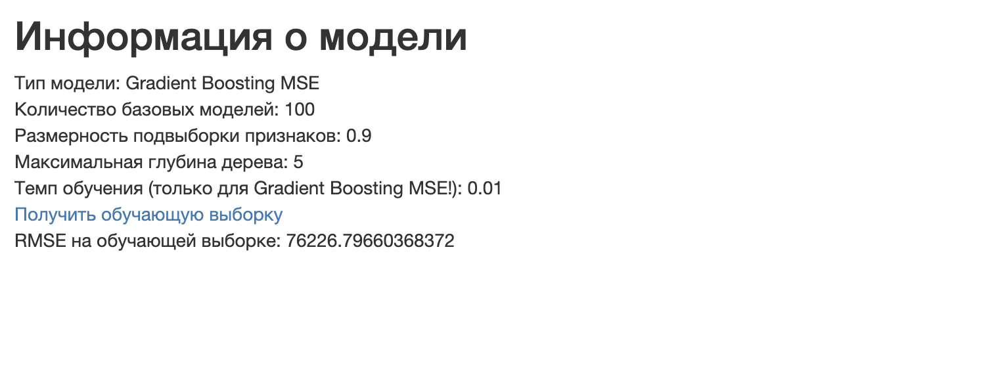

# Веб-сервис для решения задачи регрессии с помощью ансамблевых алгоритмов
Данная работа представляет собой реализацию веб-сервера для решения задачи регрессии - предсказания стоимости недвижимости по заданным характеристикам.

## Запуск

Для сборки контейнера из корневой директории необходимо выполнить команду:

```
sh scripts/build.sh
```

Для запуска:

```
sh scripts/run.sh
```

Сервис будет доступен по адресу http://localhost:5000.

## Интерфейс сервиса

На начальной странице пользователю предлагается выбрать, какая модель будет использоваться, и подобрать необходимые параметры. 


На выбор предоставляется два алгоритма - `Random Forest MSE` и `Gradient Boosting MSE`. Также пользователь может самостоятельно выбрать гиперпараметры, изменив соответствующие значения по умолчанию: 
* количество базовых моделей;
* размерность подвыборки признаков;
* максимальная глубина дерева;
* темп обучения (Внимание! Данный параметр игнорируется при выборе `Random Forest MSE`).

Для продолжения работы с выбранным алгоритмом необходимо нажать на "Создать модель".

На следующей странице пользователю предлагается выбрать датасет для обучения модели. 


Формат данных должен совпадать с форматом из соревнования [House Sales in King County, USA](https://www.kaggle.com/datasets/harlfoxem/housesalesprediction). Целевая переменная  - столбец с названием `price`. Обязательным условием является соответствие расширению загружаемого файла - только формат csv!

На следующем этапе после нажатия на кнопку "Обучить" происходит обучение модели с заранее выбранными параметрами и данными. Данный процесс может занять какое-то время. 


После завершения обучения пользователю будет доступна информация о значении RMSE на обучающей выборке, а также ему предоставляется возможность перейти к загрузке данных для валидации при нажатии на соответствующую ссылку.


На данной странице пользователю предлагается загрузить датасет для валидации, соответствующий тому же формату, что и для обучающей выборки, возможно, без столбца `price`. Переход к валидации осуществляется с помощью кнопки "Загрузить".


Для получения предсказания алгоритма с заранее выбранными параметрами на  валидационных данных необходимо нажать на кнопку "Сделать предсказание".


Если в датасет с валидационными данными входила целевая переменная `price`, на экран будет выведено значение RMSE на данной выборке. Само предсказание доступно для скачивания в формате csv при переходе по ссылке "Получить предсказание".


Также необходимо упомянуть, что после обучения модели пользователю предоставляется возможность просмотра информации о модели при переходе по ссылке "Получить информацию о модели". Пользователь может узнать о типе модели, её гиперпараметрах,  датасете, на котором она обучалась (ссылка  "Получить обучающую выборку"), а также о значении функции потерь на этом датасете.



Желаем приятного пользования!